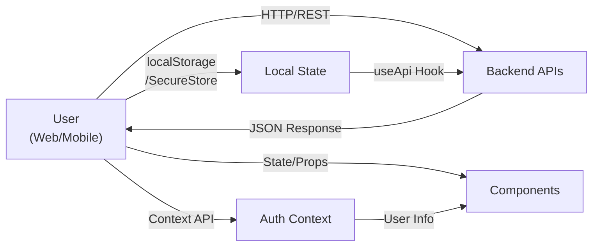

# 🎾 Pivoo Frontend

**Pivoo** es una plataforma digital para gestionar torneos, partidos y equipos de deportes individuales y de equipo (Tenis, Pádel, etc.). Frontend monorepo escalable con aplicaciones web y móvil.

## 📋 Tabla de Contenidos

- [Visión General](#visión-general)
- [Arquitectura](#arquitectura)
- [Stack Tecnológico](#stack-tecnológico)
- [Estructura del Proyecto](#estructura-del-proyecto)
- [Instalación y Setup](#instalación-y-setup)
- [Scripts Disponibles](#scripts-disponibles)
- [Features Principales](#features-principales)
- [Diagrama de Arquitectura](#diagrama-de-arquitectura)

---

## 🎯 Visión General

Pivoo es una plataforma completa para:
- **Gestión de Torneos**: Crear, administrar y participar en torneos deportivos
- **Gestión de Equipos**: Formar equipos, invitar miembros, ver estadísticas
- **Registro de Partidos**: Crear y participar en partidos, ver resultados
- **Ranking**: Sistema de puntuación y clasificaciones
- **Perfiles**: Gestión de perfiles de usuarios con historial deportivo

**Tecnología**: Monorepo con Turbo | Next.js (Web) | Expo (Mobile) | TypeScript

---

## 🏗️ Arquitectura

Este es un monorepo administrado por **Turbo** que contiene:

```
pivoo-frontend/
├── apps/
│   ├── web/           # 🌐 Aplicación Next.js (Web)
│   └── mobile/        # 📱 Aplicación Expo (Mobile)
├── packages/
│   ├── shared/        # 📦 Código compartido (tipos, API, constantes)
│   └── ui/            # 🎨 Componentes UI reutilizables
├── turbo.json         # Configuración del monorepo
└── README.md          # Este archivo
```

### Diagrama de Arquitectura

```
┌─────────────────────────────────────────────────────────────────┐
│                       PIVOO FRONTEND                             │
└─────────────────────────────────────────────────────────────────┘
                                 │
                    ┌────────────┴────────────┐
                    │                         │
            ┌───────▼────────┐         ┌─────▼──────────┐
            │   WEB (Next.js)│         │ MOBILE (Expo)  │
            │   - SSR/SSG    │         │  - Navigation  │
            │   - i18n (EN/ES)        │  - Auth Flow   │
            │   - Layouts    │         │  - Components  │
            └───────┬────────┘         └─────┬──────────┘
                    │                         │
                    └────────────┬────────────┘
                                 │
                    ┌────────────▼────────────┐
                    │   SHARED PACKAGE        │
                    │ ├─ Types & Interfaces  │
                    │ ├─ API Utilities       │
                    │ └─ Constants           │
                    └────────────┬────────────┘
                                 │
                    ┌────────────▼────────────┐
                    │   BACKEND APIs         │
                    │ ├─ Teams Service       │
                    │ ├─ Matches Service     │
                    │ ├─ Tournaments Service │
                    │ └─ Auth Service        │
                    └────────────────────────┘
```

---

## 💻 Stack Tecnológico

### Core
- **Turbo**: Monorepo build system y task orchestration
- **TypeScript**: Type safety en todo el proyecto
- **Node.js/npm**: Dependency management

### Web App (@pivoo/web)
- **Next.js 14**: Framework React con SSR/SSG
- **React 18**: UI library
- **Tailwind CSS**: Utility-first styling
- **next-intl**: Internacionalización (ES, EN)
- **Lucide React**: Icon library
- **clsx**: Utility para class names condicionales

### Mobile App (@pivoo/mobile)
- **Expo 51**: React Native development platform
- **React Native 0.74**: Cross-platform mobile framework
- **Expo Router**: File-based routing
- **React Navigation**: Native navigation
- **Expo Secure Store**: Almacenamiento seguro de credenciales
- **React Native Picker**: Componentes selectores nativos

### Shared Package (@pivoo/shared)
- **TypeScript**: Tipos compartidos entre aplicaciones
- **API utilities**: Funciones de comunicación con backend
- **Constantes**: Valores compartidos del dominio

---

## 📁 Estructura del Proyecto

### `/apps/web` - Aplicación Web (Next.js)

```
apps/web/
├── src/
│   ├── app/
│   │   ├── globals.css           # Estilos globales
│   │   ├── layout.tsx            # Layout raíz
│   │   ├── page.tsx              # Home page
│   │   ├── [locale]/             # Rutas con internacionalización
│   │   │   ├── layout.tsx        # Layout por locale
│   │   │   ├── page.tsx          # Home localizado
│   │   │   ├── login/page.tsx    # Login
│   │   │   ├── register/page.tsx # Registro
│   │   │   ├── matches/          # Gestión de partidos
│   │   │   ├── teams/            # Gestión de equipos
│   │   │   ├── tournaments/      # Gestión de torneos
│   │   │   ├── rankings/         # Rankings
│   │   │   ├── profile/          # Perfil de usuario
│   │   │   └── complex/          # Gestión de complejos
│   │   ├── complex/ ... (rutas sin locale)
│   │   ├── login/ ...
│   │   └── ...
│   ├── components/
│   │   ├── Header.tsx            # Header navegable
│   │   ├── MatchCard.tsx         # Card de partido
│   │   └── ui.tsx               # Componentes UI base
│   ├── contexts/
│   │   └── auth.tsx             # Context de autenticación
│   ├── hooks/
│   │   ├── useApi.ts            # Hook para llamadas API
│   │   └── useUserProfiles.ts   # Hook para perfiles
│   ├── i18n/
│   │   ├── request.ts           # Configuración i18n
│   │   └── routing.ts           # Rutas con locale
│   ├── middleware.ts            # Middleware Next.js
│   ├── navigation.ts            # Navigation con i18n
│   └── services/                # Servicios de API
├── messages/
│   ├── en.json                  # Traducciones inglés
│   └── es.json                  # Traducciones español
├── public/                      # Archivos estáticos
├── next.config.js               # Configuración Next.js
├── tailwind.config.js           # Configuración Tailwind
├── tsconfig.json                # Configuración TypeScript
└── package.json
```

### `/apps/mobile` - Aplicación Móvil (Expo)

```
apps/mobile/
├── src/
│   ├── app/
│   │   ├── _layout.tsx          # Layout raíz
│   │   ├── (auth)/              # Stack de autenticación
│   │   │   ├── _layout.tsx
│   │   │   ├── login.tsx
│   │   │   └── register.tsx
│   │   └── (tabs)/              # Stack principal con tabs
│   │       ├── _layout.tsx
│   │       ├── index.tsx        # Home
│   │       ├── profile.tsx      # Perfil
│   │       └── matches/         # Matches
│   ├── components/              # Componentes reutilizables
│   ├── contexts/
│   │   └── auth.tsx            # Context de autenticación
│   └── hooks/
│       └── useApi.ts           # Hook API
├── metro.config.js             # Metro bundler config
├── babel.config.js             # Babel config
├── app.json                    # Configuración Expo
├── tsconfig.json               # TypeScript config
└── package.json
```

### `/packages/shared` - Paquete Compartido

```
packages/shared/
├── src/
│   ├── index.ts                # Exportaciones públicas
│   ├── types.ts                # Tipos e interfaces (User, Tournament, Match, etc.)
│   ├── api.ts                  # Utilidades API y configuración
│   └── constants.ts            # Constantes de la aplicación
└── package.json
```

### `/packages/ui` - Componentes UI

```
packages/ui/
└── src/                        # (Estructura a expandir)
```

---

## ⚙️ Instalación y Setup

### Requisitos Previos
- **Node.js**: v18+ 
- **npm**: v9+
- **Git**: Para control de versiones

### Pasos de Instalación

1. **Clonar el repositorio**
   ```bash
   git clone https://github.com/german607/pivoo-frontend.git
   cd pivoo-frontend
   ```

2. **Instalar dependencias**
   ```bash
   npm install
   ```

3. **Configurar variables de entorno**
   
   **Para web** (`apps/web/.env.local`):
   ```
   NEXT_PUBLIC_TEAMS_API_URL=http://localhost:3001
   NEXT_PUBLIC_MATCHES_API_URL=http://localhost:3002
   NEXT_PUBLIC_TOURNAMENTS_API_URL=http://localhost:3003
   NEXT_PUBLIC_AUTH_API_URL=http://localhost:3000
   ```

   **Para mobile** (`apps/mobile/.env`):
   ```
   EXPO_PUBLIC_API_URL=http://localhost:3000
   ```

4. **Verificar setup**
   ```bash
   npm run lint
   ```

---

## 🚀 Scripts Disponibles

Todos los scripts se ejecutan desde la raíz del proyecto usando Turbo:

```bash
# Desarrollo
npm run dev              # Inicia dev servers de todas las apps
npm run web             # Solo app web
npm run mobile          # Solo app móvil

# Build
npm run build           # Build todas las apps

# Linting
npm run lint            # Lint en todas las apps

# Web específico
cd apps/web
npm run dev             # Dev server Next.js
npm run build           # Build para producción
npm start               # Inicia servidor producción

# Mobile específico
cd apps/mobile
npm run dev             # Expo dev server
npm run android         # Build para Android
npm run ios             # Build para iOS
```

---

## ✨ Features Principales

### 🔐 Autenticación y Perfiles
- Registro e inicio de sesión de usuarios
- Gestión de perfil de usuario
- Autenticación con JWT (backend)
- Context API para estado global de auth

### 🏆 Gestión de Torneos
- Crear torneos con formatos (Single Elimination, Round Robin)
- Registrarse en torneos abiertos
- Ver estado de torneos y participantes
- Historial de torneos completados

### ⚽ Gestión de Partidos
- Crear nuevos partidos (singles o equipos)
- Registrarse como participante
- Ver detalles del partido (horario, participantes, resultado)
- Historial de partidos jugados
- Sistema de matchmaking

### 👥 Gestión de Equipos
- Crear equipos con nombre y color personalizado
- Invitar miembros por ID de usuario
- Roles: ADMIN y MEMBER
- Ver estadísticas del equipo (W/L ratio, win rate %)
- Disolver equipos
- Remover miembros

### 📊 Rankings y Estadísticas
- Ranking global de jugadores
- Estadísticas personales (victorias, derrotas, ratio)
- Win rate visual (gráfico circular)
- Partidos recientes

### 🌍 Internacionalización (i18n)
- Soporte multiidioma: Español e Inglés
- Routing basado en locale `/[locale]/...`
- Cambio de idioma dinámico
- Traducciones en JSON

### 📱 Multiplataforma
- App web responsive (mobile-first design con Tailwind)
- App nativa móvil con Expo
- Código compartido entre plataformas
- UI consistente

---

## 🔄 Flujo de Datos



---

## 📝 Contribución

1. Crear rama feature: `git checkout -b feature/mi-feature`
2. Commit cambios: `git commit -m 'Add mi-feature'`
3. Push: `git push origin feature/mi-feature`
4. Abrir Pull Request

---

## 🛠️ Troubleshooting

### Error: `fatal: refusing to merge unrelated histories`
```bash
git pull --allow-unrelated-histories origin main
```

### Limpiar cache de npm
```bash
npm cache clean --force
rm -rf node_modules package-lock.json
npm install
```

### Turbo cache issues
```bash
turbo prune --docker
npm install
npm run build
```

---

## 📄 Licencia

Proyecto privado. Todos los derechos reservados.

---

## 👤 Autor

**Germán Pereira** - [@german607](https://github.com/german607)

---

**Última actualización**: Abril 2026  
**Status**: En desarrollo activo 🚀
